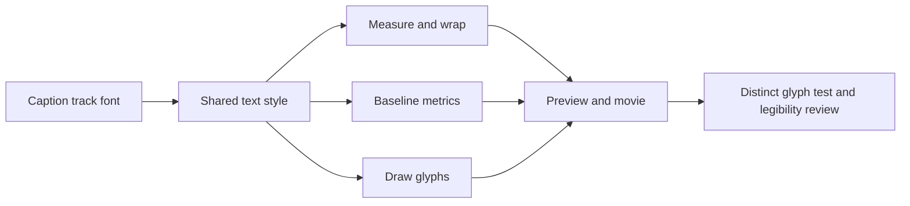

# FilmCraft Caption Font Architecture

2026-10-06. Local candidate; not an installable release.

Official CLI 0.2.0 stores the selected caption font and Unicode, but its caption rasterizer hardcodes Inter SemiBold for measurement, wrapping, metrics and drawing. Equal-length Chinese strings produce identical missing-glyph boxes in the isolated workflow test. Successful commands, SRT or nonempty images are insufficient acceptance evidence.

`runtime/caption-font-patch.json` binds the upstream commit and patch digest. The patch passes the existing caption track font consistently through all four stages, preserving sizes, timing, positioning, audio and native format. Research remains read-only; compilation uses an isolated temporary checkout. System fonts are not redistributed or downloaded.

Clone into a separate temporary directory, verify HEAD against the manifest, check/apply the patch and run `cargo test -p filmcraft-captions` followed by `cargo build -p filmcraft-cli` with the existing toolchain. Two targeted regressions failed before the fix; 36 caption component tests and 13 exchange tests passed after it.

Real preview/movie review, local text revision, audio correlation, fixed public assets/checksums, isolated first installation and affected five-plugin regression remain release gates. Previous public skill tags still select the official runtime; dev.5 source now pins the maintained variant. Candidate build and component tests do not establish public first-use readiness; Chinese visual acceptance remains failed. Model dispatch and GUI acceptance are separate.

The candidate CLI was built; an actual exported frame shows readable Chinese, with 72 decoded frames, speech correlation 0.99997449 and the original project hash preserved. The workflow now explicitly supplies burnCaptions; two new unit tests failed before and passed after this change. This is local candidate evidence, not public first-install acceptance.
