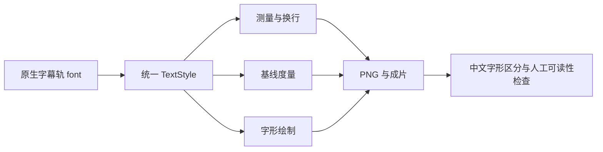

# FilmCraft 字幕字体修复架构

2026-10-06，状态：本地候选，不是可安装发布版。

## 问题与证据

官方 CLI 0.2.0 保存字幕轨 Heiti SC 字体和 zh-CN 文本，但 `crates/captions/src/burn.rs` 在字体测量、换行、字高与绘制中固定 Inter SemiBold。独立首次使用测试发现同字数“新品上市”和“轻松剪辑”输出完全相同的缺字方框；不能将命令成功、SRT 或非空画面作为中文烧录完成证明。

## 修复边界

上游提交和补丁摘要由 `runtime/caption-font-patch.json` 固定。补丁只将现有 `CaptionStyle.font` 传入测量、换行、字体度量和绘制，保留原有字号缩放、时间、背景、位置、音轨与工程格式。研究目录只读；候选在隔离临时源码副本构建。字体仍来自当前系统，不打包系统字体，不下载新字体，不替换指定字体。

## 重现与门禁

在独立临时目录克隆官方源，确认 HEAD 与清单相等，执行 `git apply --check` 后应用补丁；运行 `cargo test -p filmcraft-captions` 和 `cargo build -p filmcraft-cli`。已有 Rust 工具链可用，不安装或升级全局工具。字体变化和中文不同字形两项测试在未修复源码失败，修复后字幕组件 36 项与交换格式 13 项测试通过。

运行时发布前仍需实际预览与成片检查、字幕局部修订、音频相关性、固定公开下载地址和二进制摘要、单技能全新安装、五插件相关回归。候选构建和组件测试不满足这些门禁。既有公开技能标签维持官方运行时；dev.5 源码锁定维护版；中文视觉验收失败的状态必须保留。模型技能分发和 GUI 验收另行验证。

候选 CLI 已构建并对真实成片抽帧检查：中文可读，72 帧，配音相关性 0.99997449，原工程摘要保持一致。另修复工作流遗漏 `burnCaptions` 的问题，新增两个失败后通过的单元测试。以上使用本地候选，并非公开首次安装验收。
