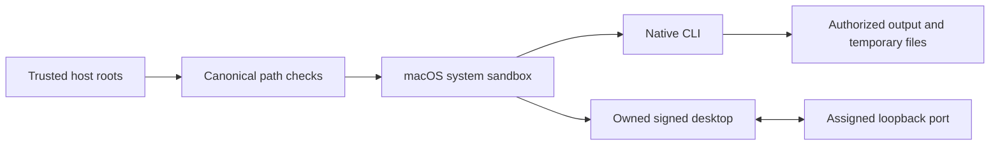

# Execution permissions / 执行权限

Public workflow, full-command run and owned desktop execution require independently supplied canonical read/write roots. Native children run in the macOS system sandbox; inputs, skill code and runtime caches remain protected, and the owned desktop bridge has only its assigned loopback port. The desktop and MCP share an authorized temporary directory for rendered frames. Actual candidate native and signed-desktop checks pass; full FC-RL-002, fixed-host qualification and eight V1 tasks remain open.

The trusted maintenance installer remains outside the native sandbox and requires an explicit runtime-home write grant. Unsupported systems refuse public execution; no sandbox bypass fallback is used. Low-level Python APIs are internal trusted interfaces. Native parameter registries, secret-reference contracts and maintenance separation still require full acceptance.

dev.54 preserves the host-provided FILMCRAFT_DATA_DIR in complete-command and owned desktop execution. Explicit model caches must be within trusted read roots and are protected from native writes; malformed/outside references refuse before installation, input reads or output creation. Temporary screenshots remain in an independently writable directory. Four target regressions and actual CLI Whisper inference from the existing read-only cache pass; no model download is needed. Full permission, business-routing and complete-command qualification remain open.

Actual signed desktop discovery confirms the explicit model cache and installed tiny model, but this official desktop build reports speech unavailable; inference is refused. CLI inference succeeds with 28 words and unchanged model digests. [Evidence](evidence/source54-readonly-model-20261009/report.json).
