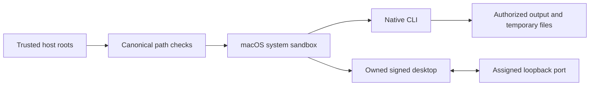

# Execution permissions / 执行权限

Public workflow, full-command run and owned desktop execution require independently supplied canonical read/write roots. Native children run in the macOS system sandbox; inputs, skill code and runtime caches remain protected, and the owned desktop bridge has only its assigned loopback port. The desktop and MCP share an authorized temporary directory for rendered frames. Actual candidate native and signed-desktop checks pass; full FC-RL-002, fixed-host qualification and eight V1 tasks remain open.

The trusted maintenance installer remains outside the native sandbox and requires an explicit runtime-home write grant. Unsupported systems refuse public execution; no sandbox bypass fallback is used. Low-level Python APIs are internal trusted interfaces. Native parameter registries, secret-reference contracts and maintenance separation still require full acceptance.

