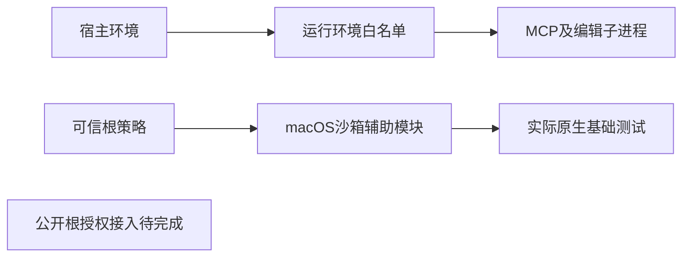

# 执行权限基础

source52对MCP／编辑子进程采用环境白名单：PATH、HOME、TMPDIR、LANG、LC_ALL、LC_CTYPE，以及绝对路径的FILMCRAFT_DATA_DIR。排除宿主密钥、包含凭据的代理配置和解释器注入变量。Session显式可信环境覆盖保留为内部API。

目录策略辅助模块校验已存在的规范真实根，并构造实际macOS沙箱命令。不支持的平台调用该辅助模块时拒绝执行。测试覆盖根外读写、只读输入、父目录链接替换及执行文件目录保护。

公开工作流尚未消费目录策略，辅助模块不代表完整权限执行。根策略与宿主授权绑定、所有原生路径接入、维护权限分离仍属于FC-RL-002未完成项。不宣称完整V1、市场、其他平台或秘密引用验收。

