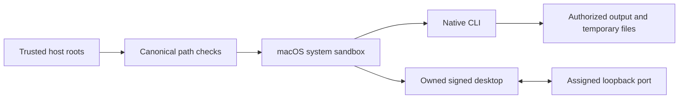

# Execution permissions / 执行权限

公开工作流、完整命令执行和所属桌面执行要求独立提供真实读写根；原生子进程使用macOS系统沙箱，保护输入、技能代码与运行时缓存，所属桌面桥仅开放分配的本地端口。桌面与MCP共用授权临时目录以生成渲染帧。实际候选原生和签名桌面检查通过；完整FC-RL-002、固定宿主验收及八项V1任务仍开放。

The trusted maintenance installer remains outside the native sandbox and requires an explicit runtime-home write grant. Unsupported systems refuse public execution; no sandbox bypass fallback is used. Low-level Python APIs are internal trusted interfaces. Native parameter registries, secret-reference contracts and maintenance separation still require full acceptance.

dev.54在完整命令与所属桌面执行中保留宿主提供的FILMCRAFT_DATA_DIR；显式模型缓存须处于可信读取根且受原生写保护，畸形／越界引用在安装、素材读取或输出创建前拒绝，临时截图仍写入独立授权目录。四项目标回归及现有只读缓存上的实际CLI Whisper推理通过，无需下载模型。完整权限、业务路由及全量命令验收仍开放。

真实签名桌面已发现显式缓存和已安装 tiny 模型，但该官方桌面构建报告语音识别不可用，推理被拒绝；CLI 真实识别 28 个词且模型摘要不变。[证据](evidence/source54-readonly-model-20261009/report.json)。
