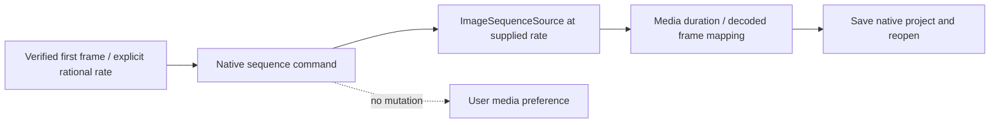

# FilmCraft Explicit Sequence Rate Architecture

## Authority and current boundary

FC-DM-001-SEQUENCE in the existing OpenSpec change owns sequence handoff. This is a native patch candidate, not an installed runtime claim. Official research source remains read-only; the patch is authored against an exported fixed upstream commit. Existing CLI 0.2.0-craft.1 locks and tags stay unchanged.

## Observed defect

Native `file.importImageSequence` accepts the first numbered PNG but uses the media indeterminate timebase. Twelve frames from a 12 fps Effect composition import at 30000/1001 fps, lasting about 0.4 seconds. Setting the Film timeline to 12 fps does not change the source. The explicit-rate regression first failed on the actual native frame rate.

## Candidate contract

The command gains an optional rational `frameRate: {num, den}`. Both integers must be positive and the rate must lie between 1 and 240 fps. The native sequence source is created at this rate; global and session media preferences are not modified. Without the new field, the original media-preference import behavior remains. The public Python asset and Art sequence contracts still require implementation.

## Build and compatibility

`runtime/sequence-rate-patch.json` pins the upstream commit and combined patch hash, including the previously published caption-font correction. `build_sequence_runtime.py` uses the checksum-gated builder to produce a separate 0.2.0-craft.2 candidate. Caption and image-sequence component tests precede the release build. Existing archives, user caches and research files are preserved. The native build is not public first-use evidence.

## Acceptance and remaining work

[Candidate evidence](evidence/explicit-sequence-rate-candidate-20261006.json): four native sequence tests pass, including explicit twelve-frame timing, real frame-six decoding, save/reopen and unchanged preferences. Native engine regression passes 281 tests with three ignored; Film Python default suite has 37 passes and 16 first-use skips. Four builder boundary tests pass. Remaining gates include the completed binary, default public cold installation, sequence manifest verification/collection, dynamic RGBA compositing and relocated project reopening, Art mixed artifacts and full creative acceptance.

## Complete sequence collection candidate (2026-10-06)

The original Project Manager copied only the first frame. A native regression first failed because no per-frame collection entries existed. The combined patch now copies each sequence into `ImageSequences/item-<id>/`, preserving numbered file names and the native first-frame entry, and returns per-frame `sequenceFiles` source/destination records. It does not transcode sequences. Planning rejects missing frames or counts inconsistent with imported duration before creating the destination.

[Component evidence](evidence/sequence-collection-candidate-20261006.json): seven sequence tests pass, covering byte-for-byte collection, frame-six decoding with the source directory unavailable, same-name isolation, partial alpha preservation and missing middle/final frame rejection. The engine suite passes 284 tests with three ignored. The patch applies to the pinned upstream source without modifying research. The previous craft.2 archive predates this collection fix and cannot prove the current candidate; a new build and verification are required. Public independent skill integration, dynamic compositing, Art integration and full V1 acceptance remain open.

## Current combined binary verification

The rebuilt craft.2 archive passed one real CLI test (0.497 seconds), bound to archive, binary and combined patch hashes. After collecting twelve frames and making the source directory unavailable, the native project rendered frames 0, 6 and 11 with distinct outputs, correct opaque region colors, transparent background and partial-alpha compositing. Original input bytes stayed unchanged. The test uses generated animated image fixtures; it does not connect the public Effect delivery or Film independent workflow and does not prove MP4 export, public cold installation or Art mixed workflows. [Binary evidence](evidence/sequence-binary-candidate-20261006.json).
