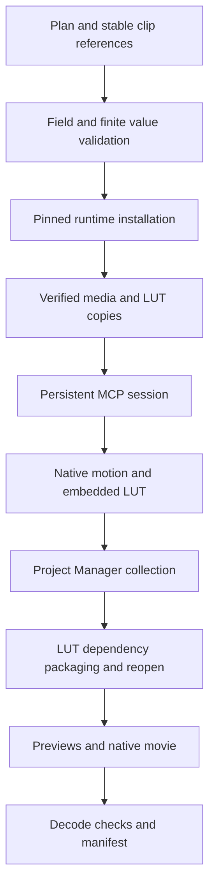

# FilmCraft Motion and LUT Workflow Architecture

> Updated: 2026-10-06. Candidate skill source; OpenSpec FC-DM-005-MOTION-LUT. Immutable plugin and Art acceptance remain pending.

## 1. Goals and boundaries

Provide a self-contained workflow in independently installed motion, color and editing skills. Keep the public pinned native runtime 0.2.0-craft.2 unchanged. Support explicit clip parameters, keyframes, registered LUT dependencies, native saving and relocated revisions. This increment does not cover every effect, graphics operation, speed change or keyframe timing layout.

## 2. Components and execution

LUTs are dependencies rather than media: skip media probe, import and relink. Register kind: lut with a digest. Native assignment receives the verified staged path and embeds LUT text into .fcproj. Preserve the LUT file under luts/. Existing media and sequence checks remain active.

## 3. Contracts and decisions

| Operation | Required fields | Optional fields | Constraints |
|:---|:---|:---|:---|
| effects.toggleAnimation | clip, effect, param | mask | Explicit target; never replay toggles automatically |
| effects.setParam | clip, effect, param, value | mask, time | Finite scalar/array values; decimal tick strings |
| lumetri.setInputLut | clip, asset | None | Registered LUT only; reject arbitrary path |

Clip IDs may use native IDs or returned bindings. Validate resolved motion parameters and clip targets again. The pinned native CLI validates effect/property semantics; generic JSON validation is not proof of every property type. Resource registration preserves source identity and portable dependencies. Keeping the runtime unchanged avoids introducing unrelated compatibility changes.

## 4. Revision and recovery

Verify the source project digest and expected revision first. Copy package media and LUTs with hash checks, relink media, and allow reuse of existing LUT aliases. Save changes to a new directory and preserve the source package. Reopen and compare the complete sequence including effects. If an output directory exists when execution fails, keep failure.json for diagnostics without publishing a success manifest. Invalid input creates no delivery directory. Timeouts retain the existing unknown/no automatic replay policy.

## 5. Evidence and remaining gates

The single candidate motion skill downloads the public runtime into an empty directory. Its public workflow command saves a project containing captions, existing audio, motion and a LUT. Rendering after removal of the original LUT with an empty user library verifies green pixels. Relocated revisions update motion while retaining two keyframes, non-target Lumetri, captions and audio clips. Independent FFmpeg decoding verifies 24 movie frames, LUT pixels and unchanged decoded audio. Invalid revisions preserve the source and skill bytes.

Evidence: docs/evidence/motion-lut-workflow-candidate-20261006.json. Tests: tests/test_motion_lut_workflow.py and tests/test_motion_lut_first_use.py. The latter requires existing FFmpeg/Pillow, public network access and CRAFT_MOTION_LUT_FIRST_USE=1.

Task 4.40 remains open: immutable source/plugin publication, actual host installation and Art mixed orchestration. Candidate evidence does not establish GUI, every effect/timing layout or creative acceptance.
