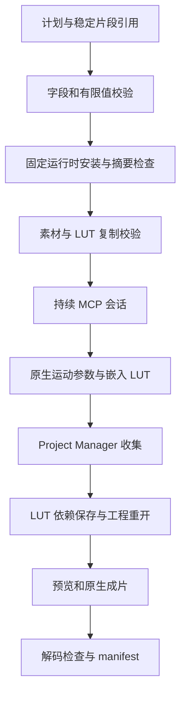

# FilmCraft 运动与 LUT 工作流架构

> 更新：2026-10-06。范围：候选技能源；OpenSpec FC-DM-005-MOTION-LUT。固定插件与 Art 验收未完成。

## 1. 目标与边界

为单独安装的运动、调色或完整剪辑技能提供相同自包含工作流。沿用公开固定原生 0.2.0-craft.2，不修改研究仓库或二进制。提供明确片段的参数与关键帧操作、登记 LUT、原生保存及移动返工。此增量没有覆盖所有效果、图形、速度变化或全部关键帧时间布局。

## 2. 结构与执行顺序

LUT 不是媒体，跳过媒体 probe／import／relink，以 kind: lut 与哈希登记。原生命令接收隔离复制路径，将 LUT 文本嵌入 .fcproj；原文件另存 luts/。媒体仍走已有流信息和完整序列检查。

## 3. 操作合同与决策

| 操作 | 必需字段 | 可选字段 | 失败约束 |
|:---|:---|:---|:---|
| effects.toggleAnimation | clip、effect、param | mask | 明确目标；切换不可自动重放 |
| effects.setParam | clip、effect、param、value | mask、time | 有限标量／数组；time 为十进制 ticks |
| lumetri.setInputLut | clip、asset | 无 | 只使用登记 LUT；拒绝任意 path |

允许 clip 原生 ID 或返回绑定引用；解析后再次校验目标及运动参数。效果与属性的语义由固定原生 CLI 校验，不能以通用 JSON 校验声称全部参数受支持。选择登记资源而不是直接路径，是为了保存来源身份及迁移依赖。保持既有 CLI，减少运行时升级的兼容性变化。

## 4. 修订与失败恢复

先核对旧 .fcproj 摘要及预期版本。旧素材和 LUT 均按包内路径与摘要复制，媒体重新关联；计划可引用旧 LUT 名称。目标修改另存新目录，保留原包。重开对照整个序列，包含效果参数。失败输出若已创建则保留 failure.json；不能作为成功交付。输入校验失败不创建交付。超时沿用 unknown／不自动重放原则。

## 5. 证据与剩余门禁

候选单技能从空运行目录下载公开原生运行时，通过公开 workflow 命令保存含字幕／声音／运动／LUT 的工程。删除原 LUT、使用空用户库重开渲染，检查绿色像素；移动交付后修改运动关键帧，保留两个关键帧和未目标 Lumetri、字幕、音轨。独立 FFmpeg 解码 24 帧核对实际像素，并比较解码音频；非法返工及原包／技能字节保全检查通过。

证据：docs/evidence/motion-lut-workflow-candidate-20261006.json。组件与首次使用测试分别为 tests/test_motion_lut_workflow.py、tests/test_motion_lut_first_use.py。后者需要现有 FFmpeg、Pillow、公开网络并显式设置 CRAFT_MOTION_LUT_FIRST_USE=1。

任务 4.40 保持开放：需要不可变技能源／插件发布后的实际宿主安装，以及 Art 混合调度验证。候选测试不证明 GUI、全部效果、全部时间布局或创意验收。
