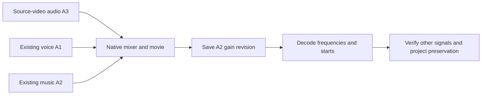

# FilmCraft Multitrack Audio Architecture and First-Use Acceptance

Installed plugin dev.8 / source dev.7 / CLI 0.2.0-craft.1 pass this test. This adds QA and specification evidence only; fixed skills, runtime and tags are unchanged.

Inputs are source-video audio at 1200 Hz, existing voice at 400 Hz and music at 800 Hz. Three independent tracks use -15, -3 and -9 dB with starts at 0, 0.25 and 0.5 seconds. The workflow places media, applies mixer.setStrip, collects assets, saves/reopens .fcproj and exports a native movie. A saved revision attenuates music by another 6 dB while preserving other objects.

The test copies only filmcraft-cli-audio from the fixed Codex 0.153.4 installation into isolated .agents/skills and publicly installs the CLI into an empty runtime directory. One real test passed in 5.333 seconds. The decoded music amplitude ratio is 0.5011844306 versus theoretical 0.5011872336; voice is 1.0000223077 and original audio is 0.9999797450. Initial relative amplitudes match the three gain differences. Before the delayed starts, voice/music components are absent while original audio is present.

Reopened native media IDs, starts, source in-points, durations and the entire sequence are preserved, along with captions, PNG preview and original delivery file hashes. All 58 host skill hashes remain unchanged. Default source regression has 36 passes and 15 explicit skips; skips are not real acceptance. [Bound evidence](evidence/codex-filmcraft8-multitrack-audio-first-use-20261006.json).

These separable synthetic tones verify static track gain and timing. Recording quality, arbitrary routing, all channel layouts, automation, GUI, model dispatch and complete creative acceptance remain unverified. Complete FC-DM-003 acceptance remains open.
