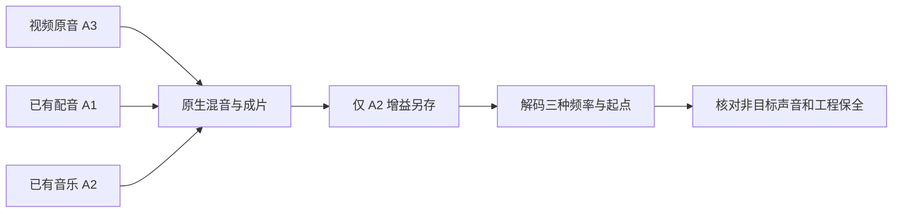

# FilmCraft 三音轨混音架构与首次使用验收

固定插件 dev.8／技能源 dev.7／CLI 0.2.0-craft.1 的已安装音频技能通过本次验收；仅补充 QA 与规格证据，不修改固定技能、运行时或标签。

输入分别为视频内原音（1200 Hz）、已有配音（400 Hz）、音乐（800 Hz）。三条独立音轨分别设置 -15、-3、-9 dB，起点为 0、0.25、0.5 秒。工作流执行 timeline.place 与 mixer.setStrip，收集素材、保存 .fcproj、重开并原生导出。音乐另存修订再降低 6 dB，其他对象保持不变。

测试从 Codex 0.153.4 固定安装目录仅复制 filmcraft-cli-audio 到隔离 .agents/skills，从空运行目录默认公开安装 CLI。真实 1 项通过（5.333 秒）。解码频率幅度的音乐修订比例为 0.5011844306（理论 0.5011872336），配音为 1.0000223077，原音为 0.9999797450。首次配音／音乐／原音的相对幅度符合三种增益差值；起点前配音与音乐频率分量缺席，原音已存在。

保存重开后的三个素材 ID、片段起点、源入点、时长及完整 sequence 保留；字幕、PNG 预览和原交付文件摘要不变。全部 58 项宿主技能摘要保留。默认源回归 36 项通过、15 项显式跳过，不能把跳过计为实际验收。[绑定证据](evidence/codex-filmcraft8-multitrack-audio-first-use-20261006.json)。

这组可分离的合成测试音验证静态音轨增益与同步，不证明真实录音质量、任意路由、全部声道、自动化、GUI、模型派发或完整创作接受。FC-DM-003 的完整验收保持开放。
