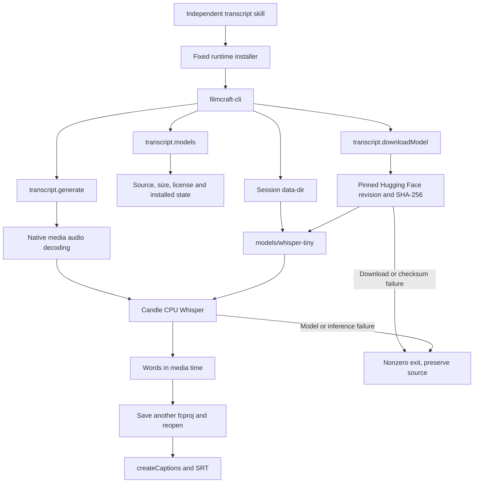

# FilmCraft native speech recognition and first use

2026-10-08; FilmCraft OpenSpec requirement `FC-DM-004-ASR`. This document defines the runtime candidate and the evidence required by runtime maintainers and transcript skill users.

## Current state and acceptance boundary

Confirmed: public runtime `0.2.0-craft.3` lacks Whisper. An actual isolated transcript skill invocation of `transcript.generate` fails, preserves the source project hash and creates no saved result. Supplied transcript/caption acceptance does not establish automatic speech recognition.

Candidate `0.2.0-craft.4` enables `filmcraft-cli/whisper` and native model downloads. The initial build passed 36 caption, 13 exchange, 8 sequence, 49 project, 15 speech and 7 engine transcript tests. The initial candidate recognized28 words and preserved native/SRT outputs using an explicit environment directory. The directory-corrected candidate passed its additional native test and release build; independent empty CLI/model cache skill acceptance passed in39.339 seconds with no skips. Source regression executed130 passing tests out of164, with34 skips. Corrected model download and inference passed using native `--data-dir` without an environment override, including native reopening, SRT and audio/video preservation. These checks do not establish completion of all five plugins.

Current source skills pin publiccraft.4. All13 independent cold installations passed in67.272 seconds; final public model/ASR acceptance passed in50.350 seconds and ten scenes in89.158 seconds, with no skips. All666 registered commands and unchanged parameter contracts were recaptured, and the actual advanced native gateway passed. Published plugins retain their prior snapshots; fixed Film/Art and new source package publication checks remain pending.

## Architecture

Use the upstream Rust Candle implementation and its real `Transcriber`. `FixedTranscriber` remains a unit-test fixture. The reference text must never enter inference; `transcript.set` cannot substitute for real recognition. Recognition is synchronous and can take time. After a timeout, inspect the process and actual outputs before repeating a write operation.

## Build and directory correction

`scripts/build_whisper_runtime.py` consumes `runtime/whisper-runtime-patch.json`. It exports upstream commit `adfd9a66de2bebc764c7f57435ccdf0f1d2e1df6` into an isolated copy, leaving research read-only. The combined patch retains caption font, image sequence and audio sample duration corrections. The explicit feature allowlist accepts only `whisper`; old recipes retain their default arguments. Invalid features or patch hashes fail before source export and compilation.

Confirmed directory defect: the CLI passes `--data-dir` to the session export preset library, while speech reads only the default user directory. The candidate correction makes model listing, downloading and loading prefer the declared session directory, then use the original fallback. It does not mutate process environment. A two-session directory isolation test is added. The old public runtime reproduces the mismatch; corrected independent-skill downloads and reads passed; public source installation passed; fixed plugin/Art snapshots still require verification.

Model files belong under the declared `models/<model-id>/`. Skill directories, CLI caches and model data directories are distinct. Do not assume `/mnt/skills/user`.

## Model and acceptance contract

The real inference sample uses multilingual `whisper-tiny`, revision `169d4a4341b33bc18d8881c4b69c2e104e1cc0af`. Four files total153,547,868 bytes. Source: OpenAI Whisper on Hugging Face. Weights are MIT; conversion artifacts are Apache-2.0, subject to the native catalogue and packaged attribution. Download weights into declared data storage; never bundle or commit them.

Show the source, license and size from `transcript.models` before downloading, and apply existing task authorization for required dependencies. Validate every file size and pinned SHA-256, then verify repeat installation preserves existing files. Upstream `installed` checks only file sizes; it cannot independently prove local weight integrity.

The acceptance input is approximately nine seconds of generated English speech. Only audio enters inference. Compare the recognized words to the reference, check word times against media bounds, reopen the saved native project and export SRT. Compare source hashes, audio/video tracks and unrelated content before and after recognition. Sample word coverage establishes only that sample, not general accuracy. Chinese, multiple speakers, noise and long audio retain separate acceptance gates.

## Release and recovery

Record archive, binary, provenance and combined patch SHA-256 values. Preserve actual failure logs and derived projects. Use a new candidate output directory after fixes; retain immutable published releases. Close `FC-DM-004-ASR` only after real inference, public runtime installation, fixed skill snapshots and host acceptance pass. The task remains incomplete.
