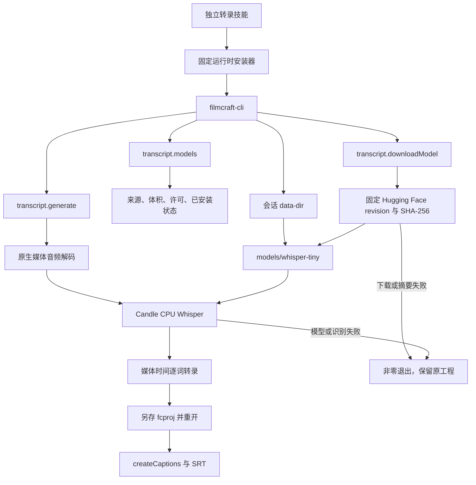

# FilmCraft 原生语音识别构建与首次使用

2026-10-08；对应 FilmCraft 插件 OpenSpec `FC-DM-004-ASR`。本文记录候选运行时设计与验收边界，供运行时维护者和转录技能使用者阅读。

## 当前事实与交付边界

已确认：公开 `0.2.0-craft.3` 未编译 Whisper。实际独立转录技能调用 `transcript.generate` 失败，原工程摘要保持不变，未产生另存工程。已有逐词转录导入与字幕生成的验收不证明自动识别。

候选 `0.2.0-craft.4` 启用 `filmcraft-cli/whisper`，同时启用原生模型下载。首次候选构建的字幕36项、交换13项、序列8项、工程49项、语音15项和引擎转录7项测试通过；首个候选真实识别28词并通过工程/SRT保全，使用显式环境目录。目录修复候选已通过新增原生测试及release编译，独立技能空CLI/模型缓存验收39.339秒无跳过通过。技能源码回归164项中130项执行通过、34项跳过。模型首次下载与识别仅使用原生 `--data-dir`，无需环境目录覆盖，另存重开与SRT及音视频保全通过，不将这些结果当成五插件完成验收。

当前源技能锁定公开craft.4，13个独立技能各自空缓存安装67.272秒通过；实际模型／ASR最终复验50.350秒及十场景89.158秒无跳过通过。666条注册命令及原参数已重新采集，实际高级命令网关通过。已发布插件仍保留旧快照，固定Film／Art验收与新技能源包发布核验仍待完成。

## 架构与执行路径

采用上游已有 Rust Candle 推理，实现真实 `Transcriber`；`FixedTranscriber` 仅用于上游单元测试。参考文本不能输入识别器，不能用 `transcript.set` 代替真实识别验收。识别同步运行，长素材可能耗时；超时先检查进程和实际产物，不自动重放写操作。

## 构建与目录修复

构建入口为 `scripts/build_whisper_runtime.py`，配方为 `runtime/whisper-runtime-patch.json`。固定上游提交 `adfd9a66de2bebc764c7f57435ccdf0f1d2e1df6` 导出到隔离副本；research 保持只读。组合补丁保留字幕字体、图像序列和音频采样时长修复。Cargo 特性仅接受显式 `whisper`，旧配方保持原有默认参数；摘要错误或非法特性在导出/编译前拒绝。

已确认的目录缺陷：原生 CLI 将 `--data-dir` 传给会话导出预设，而语音模块只读取默认用户目录。候选补丁使模型查询、下载和加载优先取会话数据目录，再回退原有默认目录；不更改进程环境变量。新增两会话目录隔离测试。公开旧运行时已复现目录不符；修复后的独立技能首次下载与读取已验证，公开源技能安装已通过，固定插件／Art快照仍须验证。

模型文件位于声明目录下 `models/<model-id>/`；技能安装目录、CLI 缓存和模型数据目录分别记录，不使用固定 `/mnt/skills/user` 假设。

## 模型与验收合同

真实验收选用多语言 `whisper-tiny`，固定 revision `169d4a4341b33bc18d8881c4b69c2e104e1cc0af`，四文件共153,547,868字节。来源为 OpenAI Whisper 的 Hugging Face 仓库；权重许可 MIT，转换制品 Apache-2.0，以原生模型清单及打包 attribution 为准。权重下载到声明数据目录，不打包、不提交到源码仓库。

下载前展示 `transcript.models` 的来源、许可和体积，按当前任务授权执行必要依赖安装。下载校验每文件长度与固定 SHA-256；重复安装验证已有文件保持不变。当前源码的 `installed` 状态只检查文件体积，因此不能用该标志单独证明本地权重完整性。

验收输入为自行生成的约9秒英语口播，识别器只接收音频。用参考文本核对识别内容，检查逐词时间在媒体范围内、另存重开和 SRT；比较识别前后原工程摘要、音视频轨道及非目标内容。该样例的词覆盖率只能证明本次样例，不推广为通用准确率。中文、多人、噪声和长音频分别保留后续验收门禁。

## 发布与恢复

候选 archive、binary、provenance 和组合补丁均保留 SHA-256。候选失败时保留实际日志和派生工程，修复后使用新候选输出目录；不覆盖旧的 immutable release。只有真实识别、公开运行时安装、固定技能快照和宿主验收完成后才关闭 `FC-DM-004-ASR`。当前该任务仍未完成。
