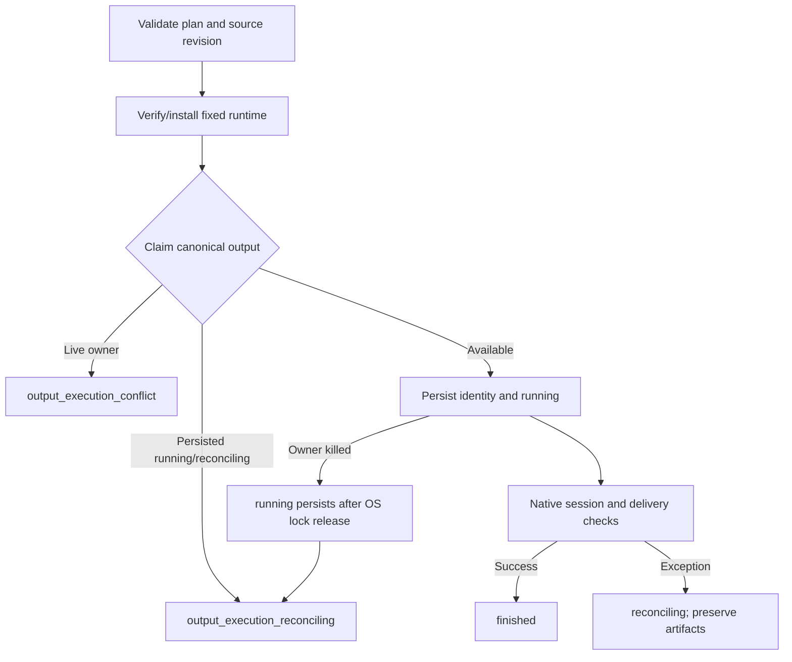

# FilmCraft Output Execution Guard Architecture

> **Purpose**: Define the standalone workflow candidate's target claim and interruption boundary.
>
> **Version**: V1.0.0
> **Updated**: 2026-10-07

## 1. Problem and scope

The released standalone workflow checks output existence before installation but claims the delivery directory later, after native operations may already have started. Two callers can therefore start native sessions for the same absent target. This candidate claims a canonical output identity after runtime verification and before native session startup. It does not replace Art orchestration or establish complete standalone task idempotency, authorization, cancellation or shared budgets.

## 2. State and data flow

The parent directory contains a persistent `.filmcraft-execution-<canonical-target-hash>.json` record. It binds planHash, inputHashes, projectRevision and runtimeSha256, with no raw plan or input paths. A nonblocking file lock prevents concurrent owners. The record is not removed when the owner disappears, since native children may outlive it. Unknown records prevent automatic replay; no automatic clearing or takeover is supplied. Existing user directories, unrecognized registration files and registration symlinks are preserved or rejected.

## 3. Verification and delivery

The public workflow regression first failed because it reached native-session loading instead of rejecting the conflicting claim. Seven target tests cover public-entrypoint ordering, real subprocess competition, SIGKILL persistence, exception state, independent targets and user-file boundaries. A copied single-skill candidate with an empty runtime exercises actual native creation, export, reopen and source revision. Detailed results and source fingerprints are in [candidate evidence](evidence/filmcraft-output-execution-candidate-20261007.json).

The helper and workflow are synchronized into all 13 independent skills. Native binaries and their locks remain unchanged. The initial source candidate is now published as skills29/plugin31; task3.14 fixed-installation repetition passed. Art still pins Film28 and needs its own upgrade acceptance. Other three standalone domains and complete task contracts remain open.

Fixed installed proof: [receipt](evidence/filmcraft31-fixed-output-execution-first-use-20261007.json).

---

**Document version**: V1.0.0
**Created**: 2026-10-07
**Updated**: 2026-10-07
**Status**: Film31/source29 fixed first-use verified; complete V1 pending
