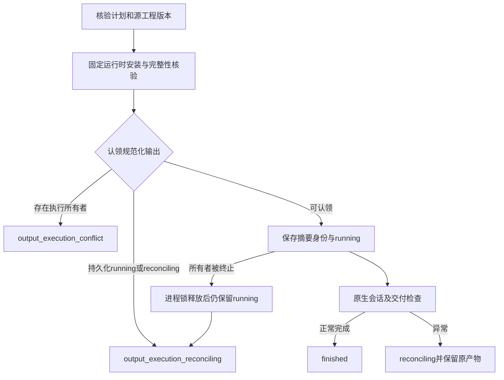

# FilmCraft 同目标执行保护架构

> **文档说明**：定义独立工作流候选的目标认领与中断边界。
>
> **版本**：V1.0.0
> **最后更新**：2026-10-07

## 1. 问题与范围

技能源29发布前，独立工作流在安装前检查输出存在性，但较晚才认领交付目录；两个调用者可能已为同一尚不存在的目标启动原生会话。已发布技能源29在运行时完整性核验后、原生启动前绑定规范化输出身份。不代替Art编排器，不宣称独立任务完整幂等、授权、取消或共享预算已完成。

## 2. 状态与数据流

父目录持久化 `.filmcraft-execution-<规范目标路径摘要>.json`，绑定planHash、inputHashes、projectRevision与runtimeSha256，不存原始计划和素材路径。非阻塞文件锁排除竞争。所有者消失不删除登记，因为原生子进程可能仍在运行；未知登记阻止重放，不提供自动清理或接管。已有用户目录、不认识的登记文件及登记符号链接被保留或拒绝。

## 3. 验证与交付

公开入口回归先复现了缺口：竞争声明尚未检查就进入原生会话加载。七项目标测试覆盖入口顺序、真实子进程竞争、SIGKILL身份保留、异常状态、不同目标与用户文件边界。单独复制候选技能并从空运行时执行实际原生创建、导出、重开和源修订。结果与源码摘要见[候选证据](evidence/filmcraft-output-execution-candidate-20261007.json)。

helper与workflow已同步13个独立技能。原生二进制及锁未变。初始源码候选现已发布为技能源29／插件31，任务3.14固定安装复验通过。Art99／源73现已固定Film29，并通过单独固定安装的冷混合创建／返工／复用和移动验包门禁；完整V1仍开放。其他三个独立领域和完整任务合同保持开放。

固定安装证明：[证据](evidence/filmcraft31-fixed-output-execution-first-use-20261007.json)。

---

**文档版本**：V1.0.0
**创建日期**：2026-10-07
**最后更新**：2026-10-07
**文档状态**：Film31／源29固定首用已验；完整首版待完成
