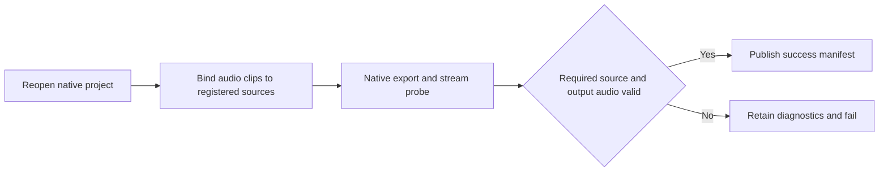

# FilmCraft Required Source Audio Architecture and Acceptance

Fixed plugin dev.9 / source dev.8 retain CLI 0.2.0-craft.1 and fix false audioRequired success. Installed-plugin verification passed. FC-DM-003-EMPTY is authoritative.

Old fixed plugin dev.8 / source dev.7 exported silent AAC with no native source audio clips. Checking only the exported stream falsely accepted this output; a real failure test failed because no error was raised in 4.514 seconds. The workflow now binds reopened audio clip item IDs to registered media probe.audio, then checks the exported stream, preserving the public export_audio_missing failure code.

Retain .fcproj, movie, preview, audio-check.json, export-probe.json and failure.json without a success manifest. Never overwrite an existing failed output directory. Explicit audioRequired=false supports video-only delivery; intentional silent WAV source audio remains valid. Successful delivery hashes audio-check.json.

A candidate audio skill copied alone publicly installs into an empty runtime directory. The real public workflow.py exits 1 with export_audio_missing. Independent decoding confirms generated AAC has a zero waveform; diagnostic file hashes survive retries. Explicit optional audio and intentional silent source audio both pass. One real test passed in 6.530 seconds. Default source regression: 36 passes, 16 explicit skips. [Candidate evidence](evidence/required-audio-candidate.json).

This checks source presence, not audibility, speech content or creative quality. Codex 0.153.4 fixed installation discovers 58 skills with zero errors. The installed audio skill passes three real public empty-runtime tests in 16.735 seconds: required-audio failure plus single/multitrack gain regressions. All installed hashes are retained. [Installed evidence](evidence/codex-filmcraft9-required-audio-first-use-20261006.json). Separate gain movie manifests were not persisted in this run; actual assertions and driver fingerprints are recorded. ArtCraft still requires its domain dependency upgrade.

ArtCraft dependency integration is now verified with plugin dev.49 / skills dev.36 / runtime dev.48, using FilmCraft source dev.8: real missing-source-audio failure retains diagnostics and blocks its consumer; positive native mixed gain revision passes; repeated failed attempts/budgets remain unchanged. Film task 4.29 is complete at this scope. [Evidence / 证据](evidence/codex-release49-required-audio-mixed-first-use-20261006.json).
