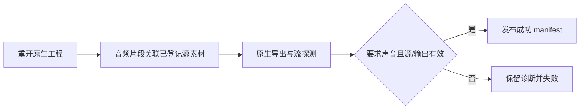

# FilmCraft 必需源音轨门禁架构与验收

固定插件 dev.9／技能源 dev.8 保持 CLI 0.2.0-craft.1，修复 audioRequired 的错误成功；安装副本复验已通过。规范事实源为 FC-DM-003-EMPTY。

旧固定插件 dev.8／技能源 dev.7 在没有源音频片段时仍导出静音 AAC，原门禁只看输出流是否存在，真实失败测试因未报错而失败（4.514 秒）。现在核对重开后的音频片段 item 与已登记素材的真实 probe.audio，再核对输出流；同一个 export_audio_missing 错误保持公开失败语义。

诊断保留 .fcproj、电影、预览、audio-check.json、export-probe.json 与 failure.json，无成功 manifest。已有失败输出目录拒绝覆盖。有意视频无声用 audioRequired=false；真实静音 WAV 仍有源音轨，不按零幅度误拒绝。audio-check.json 纳入成功交付摘要。

候选单音频技能空运行目录公开安装后，实际公开 workflow.py 返回 exit 1 和 export_audio_missing；独立解码确认自动 AAC 波形为零，诊断文件摘要保全，明确可选声音和有意静音源均成功。真实 1 项通过（6.530 秒）。源默认回归 36 项通过、16 项显式跳过；[候选证据](evidence/required-audio-candidate.json)。

本门禁验证源存在，不承诺可听度、语音内容或创作质量。Codex 0.153.4 固定五插件安装发现 58 技能、零错误；安装后的音频技能独立空运行目录缺源音轨验收和单／三轨增益回归共 3 项通过（16.735 秒），全部宿主摘要保留。[固定安装证据](evidence/codex-filmcraft9-required-audio-first-use-20261006.json)。单／三轨回归未另存这轮成片清单，仅登记实际断言与驱动摘要；ArtCraft 旧领域依赖升级仍待验证。
