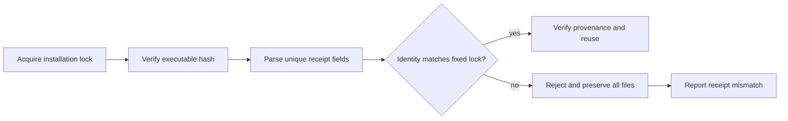

# FilmCraft Runtime Receipt Architecture

This candidate implements the existing FC-RT-001 installation identity contract. Published plugin dev.6 and its source dev.5 remain unchanged; ArtCraft still locks that published source. This document does not claim a new fixed-release or host acceptance.

## Reuse contract

Previously, reuse checked executable/provenance hashes and receipt existence. A damaged JSON receipt or a changed version/platform/source could still be reported as verified. Reuse now parses unique JSON fields and checks name, version, platform, release URL, archive/executable/provenance hashes, version output and source against the current lock. Descriptive fields such as evidenceScope are excluded from identity so historical evidence descriptions do not invalidate an intact installation.

Malformed JSON, duplicate keys or a non-object receipt returns installation_receipt_invalid. Missing receipts return installation_receipt_missing; changed identity returns installation_receipt_mismatch. Refusal does not execute, redownload, replace or repair the existing installation. Restoring the original valid receipt permits reuse. The receipt is a consistency check together with trusted artifact hashes; it is not a signed independent provenance authority.

## Evidence and remaining work

[Candidate evidence](evidence/runtime-receipt-candidate.json): 13 failing subcases reproduced before implementation; 17 installer tests pass; default regression passes 35/47 with 12 explicitly skipped live tests. A separate public cold install/native roundtrip passes, including refusal/preservation/restoration. All 11 separately copied skills discover actual commands with a system-only PATH; that suite uses one fresh shared domain runtime, not 11 independent cold downloads. Self-contained resources pass synchronization checks.

Next: fixed skill publication, vendor-only plugin synchronization and installed-snapshot acceptance, then update ArtCraft's dependency lock with its own acceptance. Other domain installers must be audited independently. These checks do not prove creative, GUI, model-dispatch, other-platform or production acceptance. OpenSpec remains implementation-in-progress; the full runtime-distribution baseline remains open.
