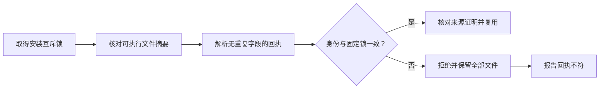

# FilmCraft 运行时安装回执架构

本变更实现既有 FC-RT-001 的安装身份约束。固定技能源 dev.6、插件 dev.7 已通过 Codex 0.153.4 的实际安装与首次使用检查。[固定发布证据](evidence/codex-filmcraft7-receipt-first-use-20261006.json)。ArtCraft dev.42 仍锁定 FilmCraft 技能源 dev.5，本变更的混合集成仍待完成。

## 复用约束

此前复用只核对可执行文件／来源证明摘要与回执文件存在性；JSON 损坏或版本、平台、来源被改动后仍可能报告已验证复用。现在解析无重复字段的 JSON，并将名称、版本、平台、发布 URL、归档／可执行文件／来源证明摘要、版本输出及来源与当前锁逐项核对。evidenceScope 等说明字段不属于安装身份，历史证据描述变化不导致完整安装失效。

JSON 损坏、重复字段或非对象回执返回 installation_receipt_invalid；缺失回执返回 installation_receipt_missing；身份漂移返回 installation_receipt_mismatch。拒绝时不执行、不重新下载、不覆盖或自动修复已有安装；恢复原始有效回执后允许复用。回执与可信制品摘要共同用于一致性核验，本身并非独立签名的来源证明。

## 证据与后续工作

[候选证据](evidence/runtime-receipt-candidate.json)：实现前复现 13 个失败子用例；安装器 17 项通过；默认回归 47 项中 35 项通过，12 项真实运行测试明确跳过。另行执行公开地址冷安装与原生重开，验证异常拒绝、文件保留和恢复复用。11 个技能分别独立复制后，在仅系统 PATH 下发现真实命令；该组使用一个全新共享领域运行时，不是 11 次独立冷下载。自包含资源同步检查通过。

技能源固定发布、vendor 同步及实际安装快照验收已完成：固定内容四项测试通过，11 个技能独立入口可用，执行后全部 58 个安装摘要保持不变。后续更新 ArtCraft 依赖锁并执行混合集成验收。其他领域安装器须分别审计。当前证据不代表创作、GUI、模型派发、其他平台或生产验收。OpenSpec 保持实施中，runtime-distribution 完整基础任务仍未关闭。
