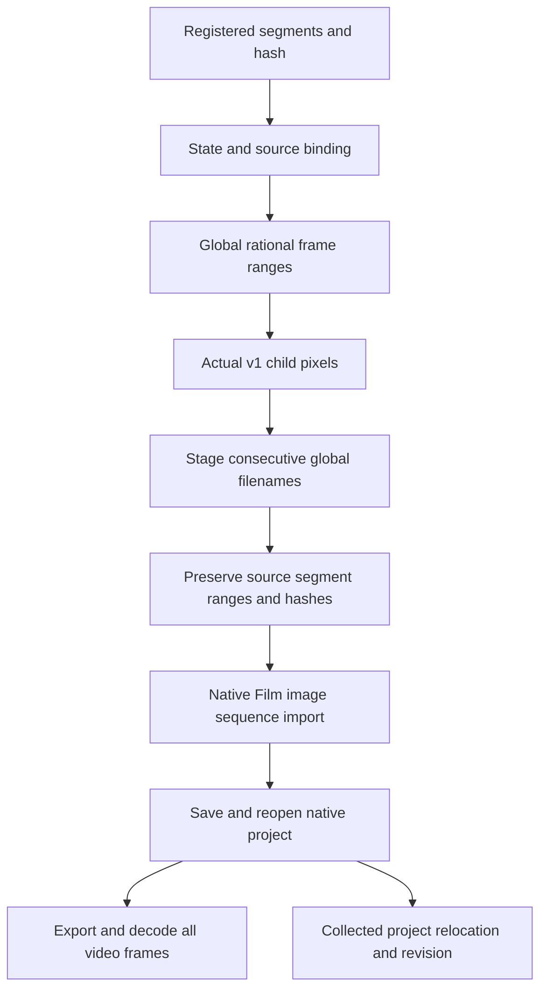

# FilmCraft Segmented Asset Consumption Architecture

Date: 2026-10-07. Status: independent-source candidate; fixed source dev.10 / plugin dev.11 are unchanged. Authority: FilmCraft plugin establish-v1-plugin, scenario FC-DM-001-SEGMENT, tasks 4.42 / 4.43.

## Input and normalization

The Effect producer checkpoint `craft-segmented-render-checkpoint/v1` expresses completed production. Film explicitly registers it as segmented-image-sequence, verifies it, then normalizes it into a domain `filmcraft-collected-sequence/v1`. The sourceSequenceSha256 of the original checkpoint and sha256 of the normalized manifest remain distinct.



Only verified checkpoints qualify. Source project/runtime hashes are provenance, not executable instructions. firstFrame ranges start at zero and have no gaps or overlap. Reduced rational start/end values must match the frame rate. Fixed child paths, v1 manifests, encoded hashes, actual RGBA pixels and transparency are verified. Missing segments, wrong timing, corrupt frames, hash conflicts and symlinks fail.

## Resource boundaries and compatibility

| Manifest | Decoded boundary | Encoded boundary |
| --- | --- | --- |
| Existing craft-image-sequence/v1 | 512 MiB total | 512 MiB total |
| Film collected manifest | 512 MiB per original segment; 64 GiB logical total / 10,000 frames | 512 MiB per segment; 2 GiB total |

Verification is sequential; the logical total is not resident memory. Segment provenance is mandatory, preventing a schema change from bypassing per-segment limits. Failed copies remove only the current staging directory. Inputs, delivered projects and installed skills remain unchanged.

The native engine imports consecutive global filenames. Actual ImageSequence properties, frame rate and duration are checked. Native collection verifies every frame again before storing the domain manifest. Relocated revisions use the collected package and existing native media relinking; original segment directories are no longer required. Existing image-sequence inputs and v1 validation remain compatible.

## Independent first use

Set SKILL_DIR to the actual loaded skill directory. Existing asset.import and timeline.place operations remain the editing interface.

```bash
python3 -I -B "$SKILL_DIR/scripts/workflow.py" /absolute/plan.json \
  --output /absolute/film-delivery \
  --segmented-sequence-asset overlay=/absolute/segments/segments.json
```

A plan may register assets.overlay with kind segmented-image-sequence, an absolute segments.json path and its actual SHA. The entry installs and verifies the fixed maintained CLI from its own runtime lock without sibling skills. Delivery stores kind image-sequence, sequenceMetadata.schema filmcraft-collected-sequence/v1 and the original sourceSequenceSha256.

For text changes, render a new Effect native project and segment checkpoint, import it as a new asset, and use clip.replaceFromBin for explicit clips. Preserve the old Film delivery and background. Invalid copies/manifests fail before publishing the new output directory.

## Evidence and remaining work

[Candidate evidence](evidence/effect-film-segment-candidate-20261007.json) covers two independently copied skills, empty runtime, public native downloads, Film CLI execution and actual output. The native fixture is 320×180, 12 fps, three segments and twelve frames, independently decoded through ffmpeg. Text revision follows project relocation and removal of original segmented inputs.

Task 4.43 remains open: full HD long intros, immutable new source/plugins, actual installed snapshots, Art segment protocol/workflow and moved delivery packages. Existing Art v1 inspection does not accept this domain manifest. Color space remains unknown; GUI, model dispatch, creative approval and cross-editor fidelity require separate evidence.

## Current fixed-release refresh (2026-10-08)

[Fixed evidence](evidence/craft-fixed-segmented-hd-refresh-20261008.json) binds actual installed Film40/source37, Effect38/source34 and Art117/source89. An isolated Art skill publicly installs four native domains and Node/core from an empty runtime and delivers 1920×1080, 24 fps, five seconds, 120 frames in four segments. Every output frame is independently decoded. Logo replacement rebuilds affected tasks; corrupt-frame refusal and exact-byte restoration preserve task/budget reuse; a moved package retains five child projects. A separate dual-domain cold-install case verifies twelve-frame segmented handoff, text revision with unchanged non-target animation keys, moved-project reopening and old-delivery preservation. The native cases pass in 255.657 and 26.797 seconds. The first dual-domain attempt failed during installation due to disk exhaustion; diagnostics are retained and a fresh empty retry passed after closed-cache cleanup.

This supplements the immutable-release and HD evidence missing at the historical candidate checkpoints above. The guide changes still require independent new-release installation qualification. This report does not qualify a new release, generic Skills CLI, GUI, creative quality or complete V1.
