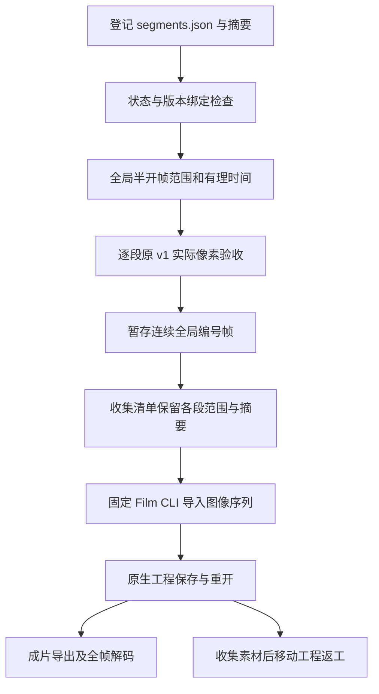

# FilmCraft 分段素材消费架构

日期：2026-10-07。状态：独立技能源候选，固定源 dev.10／插件 dev.11 未变更。规格事实源为 FilmCraft 插件 establish-v1-plugin，场景 FC-DM-001-SEGMENT，任务 4.42／4.43。

## 输入与转换

EffectCraft 分段生产器的 `craft-segmented-render-checkpoint/v1` 只表示生产完成。本候选让 Film 公开工作流通过 `segmented-image-sequence` 显式登记该输入，验证通过后转换成 `filmcraft-collected-sequence/v1` 领域收集清单。两个摘要分别保存：原检查点的 sourceSequenceSha256 与新收集清单的 sha256，禁止把转换后的字节冒充原输入。



分段输入必须处于 verified 状态。工程／运行时源摘要作为来源信息保存，消费端不执行检查点内参数。firstFrame 必须连续、从零开始；start／end 必须与有理帧率对应且约分。每段路径固定为 segment_NNNNN/sequence.json，逐段核验 v1 清单、PNG 文件及实际 RGBA 像素；缺段、重叠、错位、非透明帧、摘要冲突和符号链接拒绝。

## 资源与兼容性

| 清单 | 解码资源边界 | 编码文件边界 |
| --- | --- | --- |
| 原 craft-image-sequence/v1 | 全部最多 512 MiB | 全部最多 512 MiB |
| Film 领域收集清单 | 每原段最多 512 MiB，总逻辑最多 64 GiB／10,000 帧 | 每原段最多 512 MiB，总量最多 2 GiB |

检查逐帧进行，逻辑总量不是同时驻留的内存。领域清单必须保留原段边界，不能只换 schema 后绕过单段限制。复制失败删除本次暂存目录；源输入、已交付工程和技能安装内容保持不变。

原生引擎收到连续编号的完整序列，检查实际 ImageSequence 属性、帧率与时长。原生收集后重新核验所有帧，再保存领域清单。移动工程修订仅消费收集包，按已有流程重新关联原生素材；源分段目录不再是必要依赖。旧 image-sequence 输入和原 v1 校验保持兼容。

## 独立技能首次使用

将 SKILL_DIR 设置为实际加载的技能目录，使用已有计划中的 asset.import 和 timeline.place，不新增虚构原生命令。CLI 参数会登记完整分段输入摘要。

```bash
python3 -I -B "$SKILL_DIR/scripts/workflow.py" /absolute/plan.json \
  --output /absolute/film-delivery \
  --segmented-sequence-asset overlay=/absolute/segments/segments.json
```

计划内也可使用 `assets.overlay = {kind: "segmented-image-sequence", path: "/absolute/segments/segments.json", sha256: "实际摘要"}`。正常安装入口按本技能的 runtime.lock 校验并安装固定维护版 Film CLI；不读取兄弟技能。首次导入后，交付 assets.overlay.kind 为 image-sequence，sequenceMetadata.schema 为 filmcraft-collected-sequence/v1，并保留原 sourceSequenceSha256。

修改 Effect 文字后先生成新的工程和分段检查点，再登记为新资产，通过 clip.replaceFromBin 替换明确镜头；保持旧 Film 工程和背景不变。素材复制及规范校验失败发生在新输出发布前。

## 证据与待完成

[候选证据](evidence/effect-film-segment-candidate-20261007.json) 记录独立复制的 Effect 导出技能和 Film 媒体技能、空运行时、公开原生下载与真实成片。代表场景为 320×180、12 fps、三段十二帧，成片由 ffmpeg 独立全帧解码；移动原工程、删除原分段输入后执行文字返工。

任务 4.43 保持开放：完整 1080p 长片头、不可变新源与插件、实际安装快照、Art 分段协议／编排及移动交付包。现有 Art v1 序列检查尚不接受该领域收集清单，不能据此声称五插件混合首版已完成。色彩空间仍标记 unknown；GUI、模型派发、跨编辑器保真和创作验收仍待独立验证。

## 当前固定发行补充验收（2026-10-08）

[固定版本证据](evidence/craft-fixed-segmented-hd-refresh-20261008.json)：实际安装的 Film40/source37、Effect38/source34 和 Art117/source89 完成验证。Art 单技能从空运行时公开安装四领域及 Node/core，交付 1920×1080、24 fps、5 秒、120 帧、四段动画；独立解码全部 120 帧。Logo 替换只重建受影响任务，损坏帧拒绝、原字节恢复不重复扣预算，五子工程移动包通过。另一个双领域冷安装用例验证十二帧分段交接、文字返工时非目标动画关键帧不变、移动工程重开和旧交付保全。两个原生用例分别耗时 255.657 秒与 26.797 秒。首次双领域尝试因磁盘满在安装阶段失败，保留诊断，清理关闭缓存后另建空目录成功。

以上补充了前文历史候选阶段缺失的固定发行和 HD 证据；前文未完成说明属于其当时版本。当前修改的指南尚待独立新发行安装验证；本报告不证明新版本、通用 Skills CLI、GUI、创意质量或完整 V1。

固定 Film41/source38 与 Art118/source90 现已通过本分发门禁：23项新独立冷安装、64项安装身份、120帧HD混合返工／恢复／五子工程迁移，以及公开CLI帧率兼容／保存重开。仅关闭Art4.15和Film4.30／4.31／4.43，完整需求和V1仍开放。 [Evidence](evidence/craft-art118-segment-guide-fixed-first-use-20261008.json).
