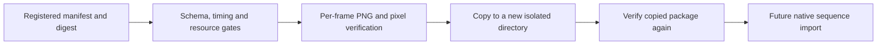

# FilmCraft Sequence Asset Contract Architecture

## Authority and phase

The existing OpenSpec FC-DM-001-SEQUENCE owns this work. The independent skill source owns the component and synchronizes it into all eleven Film skills. Plugin skill snapshots are unchanged. Manifest validation and complete copying are implemented; public workflow import, cold native installation and Art integration remain open.

## Input validation

`sequence_assets.validate_sequence(path, digest)` accepts a registered `sequence.json` and SHA-256. It validates the strict `craft-image-sequence/v1` field set, normalized rational rate, integer frame count and matching timebase. It requires a complete consecutive `frame_00000.png` set, RGBA8, actual alpha extrema and decoded pixel hashes. PNG structure, CRC, dimensions, bytes and decoded pixels are checked independently of declarations. Color space remains `unknown` and does not establish cross-editor fidelity.

## Copy and resource boundaries

`copy_sequence` creates the destination only after validation and refuses existing destinations. It copies the manifest and every frame, validates the copied package, and removes only its newly created directory on failure. Source bytes remain untouched. Symlinked, missing or extra frames, digest conflicts, duplicate JSON fields and incorrect duration are rejected. Limits are ten thousand frames, 512 MiB each for aggregate encoded and decoded bytes, and 1–240 fps. Resource checks precede image decoding and destination creation.

## Evidence and remaining work

[Candidate evidence](evidence/sequence-asset-contract-candidate-20261006.json): six target tests pass, including isolated validation from a single copied skill with unchanged skill bytes. The default suite has 43 passes and 17 first-use skips. A real twelve-frame, 12 fps RGBA Effect export passes consumer validation. Workflow registration/import/collection/revision, maintained CLI publication, public cold installation and Art mixed delivery remain pending. These component results do not complete the whole handoff requirement.
