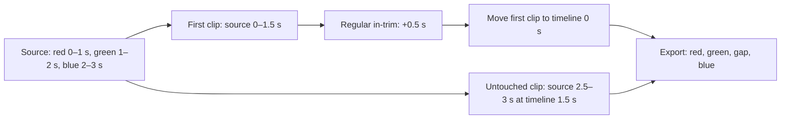

# FilmCraft Temporal Timeline Acceptance

The fixed FilmCraft plugin dev.7 / independent skills dev.6 / native CLI 0.2.0-craft.1 is used without changing immutable release contents. One actual installed timeline skill is copied alone and installs its locked native runtime into an empty directory.

## Observable behavior

The first clip reopens with start 0, sourceIn 127008000000 and duration 254016000000 ticks. The second clip remains byte-for-byte equivalent in native inspection. The audio track and caption records remain unchanged; every original delivery file digest is preserved. PNG previews and decoded native MP4 frames independently show red at 0.25 s, green at 0.75 s, black gap at 1.25 s and blue at 1.75 s. Thus a correct-looking clip count cannot hide an incorrect source in-point. The output retains 24 frames and a native editable project.

Numeric trim delta is refused: the workflow requires a decimal-string tick value. The rejection creates no successful manifest and preserves the original project. All 11 original installed skill digests still match the fixed lock after execution.

## Evidence boundary

One live case passes in 5.294 s. Existing ffmpeg and Pillow are independent QA tools; the workflow renders and exports through the native FilmCraft engine. Audio is a synthetic sine fixture. This covers ordinary in-trim and a non-insert move at 12 fps, not ripple/roll, all fractional rates, all timeline commands or creative acceptance. [Fixed identity, source and output hashes](evidence/codex-filmcraft7-temporal-timeline-first-use-20261006.json).
